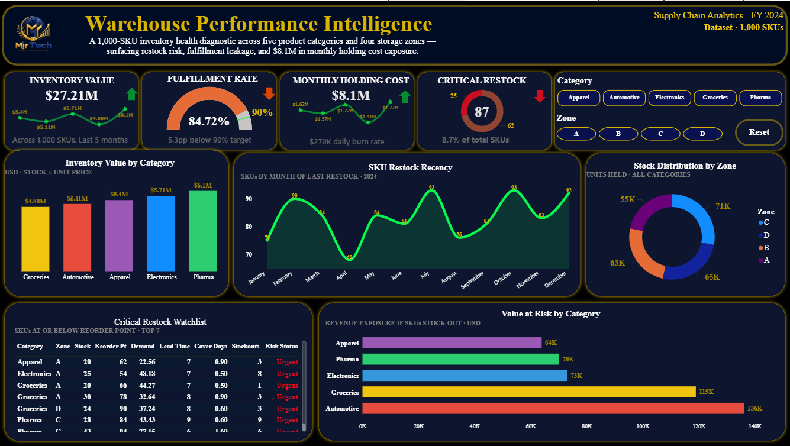

<div align="center">

<br/>
<a href="#"></a>
 
<a href="#"></a>
 
<a href="#"></a>
 
<a href="#"></a>
<br/><br/>

&nbsp;

&nbsp;

&nbsp;

<br/><br/>
  📦 Warehouse Performance Intelligence
  
> An end-to-end inventory health diagnostic for a 1,000-SKU supply chain. Built in **MySQL** for data cleaning and modelling, then visualised in **Power BI** to surface restock risk, fulfillment leakage, and holding-cost exposure.



# 📦 Warehouse Performance Intelligence

> I took raw inventory data for 1,000 products, cleaned it in SQL, and built a Power BI dashboard that does more than look good. It points to what the warehouse should actually do next.


## The story behind this project

I want to share how I got here, not just the final result.

The starting point was raw data for 1,000 products, and it was messy in all the ways real data usually is. Before any of it could become a dashboard, it had to be cleaned and checked, and that turned out to be where most of the real work happened. A good dashboard doesn't just show you what happened. It tells you what to do next, and that was the whole goal here.

## Step 1: Cleaning the data in SQL

Before building a single chart, I cleaned everything in SQL. I checked for missing values across the key columns, removed duplicate product IDs, and fixed inconsistent text so that "Automotive" and "automotive " would be treated as the same category rather than two different ones. I also made sure the numbers actually made sense, confirming for example that stock levels were never sitting below zero. None of this is glamorous, but skipping it is how you end up with a polished dashboard built on numbers nobody should trust.

Here are a few of the checks I ran along the way. The first was simply getting eyes on the raw table to understand its shape.

```sql
SELECT * FROM supplychain.warehouse;
```

Then I looked for missing values in the columns that mattered most.

```sql
-- Check for missing values in key columns
SELECT *
FROM warehouse
WHERE item_id IS NULL
   OR category IS NULL
   OR stock_level IS NULL
   OR reorder_point IS NULL
   OR daily_demand IS NULL;
```

I checked for duplicate product IDs, since a single product counted twice quietly throws off every total downstream.

```sql
-- Find duplicate item IDs
SELECT item_id, COUNT(*) AS duplicate_count
FROM warehouse
GROUP BY item_id
HAVING COUNT(*) > 1;
```

And I flagged demand values that were far too high or too low to be believable, the kind of thing that usually signals a data entry slip rather than a real spike.

```sql
-- Detect outliers in daily demand
SELECT *
FROM warehouse
WHERE daily_demand > (SELECT AVG(daily_demand) * 3 FROM warehouse)
   OR daily_demand < (SELECT AVG(daily_demand) / 3 FROM warehouse);
```

Once the data was clean and I trusted it, I pulled the final table the dashboard runs on. It includes a simple forecast for the next seven days of demand.

```sql
SELECT
    category,
    zone,
    stock_level,
    daily_demand,
    ROUND(daily_demand * 7, 2) AS forecasted_demand_next_7d,
    reorder_point,
    lead_time_days,
    turnover_ratio,
    stockout_count_last_month,
    order_fulfillment_rate,
    picking_time_minutes
FROM warehouse_clean;
```

## Step 2: Building the dashboard in Power BI

With clean data in hand, I built the visuals and wrote the calculations behind them. The report covers 1,000 products across five categories (Apparel, Automotive, Electronics, Groceries, Pharma) and four storage zones (A, B, C, D).

A few headline numbers came out of it straight away. The business has $27.21M tied up in stock, while its fulfillment rate sits at 84.7%, which is below the 90% target. Monthly holding cost comes to $8.1M, working out to roughly $270K a day just to keep inventory on the shelves, and 87 products are currently sitting at or below their reorder point.

The page is laid out so your eye moves from the summary at the top, down through the category and zone breakdowns in the middle, and finishes on the restock watchlist and the revenue at risk at the bottom. Category and zone slicers let you filter the whole thing in a couple of clicks.

## Step 3: What the data actually told me

This is the part I care about most.

The risk in this warehouse is not spread evenly, it is concentrated. Automotive and Groceries make up only 39% of the products, yet they account for 56% of everything running low. That alone tells you where attention should go first.

There is also a lot of dead weight on the shelves. Around $13.5M of stock has not moved in over six months, and nearly half the catalogue, 49%, has not been restocked in more than 180 days. That is inventory the business is paying to store while it may not even be selling.

Picking is slower than it should be, too. The average pick time is 97 seconds, roughly 60% slower than the best warehouses, which tend to sit closer to 60 seconds. A gap that size usually points to a layout problem rather than anything to do with the products themselves.

The encouraging part is that the fulfillment target looks reachable without spending more. We are at 84.7% against a 90% goal, and the data suggests that smarter restocking, rather than buying additional stock, is enough to close that gap.

## Step 4: What I would recommend

A few things follow naturally from the numbers. Automotive and Groceries need a bigger safety buffer so they stop running low so often. The $13.5M of slow moving stock deserves a proper review to decide what to clear out or simply stop ordering. The warehouse layout should be reorganised so the most picked items are the easiest to reach, which is the most direct way to bring that 97 second pick time down. And restocking should shift to a demand based approach, since that is what gets fulfillment to 90% without adding cost.

## Tools

SQL for the cleaning and the analysis, and Power BI for the dashboard.

## A quick note

The dashboard is nice to look at, but the cleaning and the insights are where the real work lives. I am still learning every day, but this is one I am proud of.

By Fredrick J Machemba
